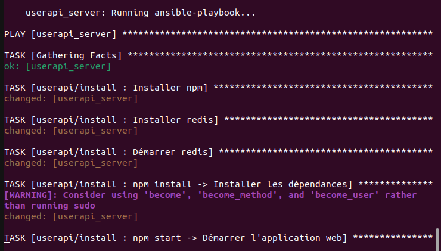

# ece-devops-projet

## Contributors

- MASSINE AGHARMIOU
- FODERE Vincent
- RAHEM Massinissa

## Partie 01

### Création d'une application web

Dans cette partie, nous avons créé une application web en utilisant Node.js et Redis. L'application est une simple API utilisateur qui permet de créer, lire, mettre à jour et supprimer des utilisateurs.

## Partie 02

### CI/CD pipeline

Dans cette partie, nous avons mis en place un pipeline d'intégration continue et de déploiement continu (CI/CD) en utilisant GitHub Actions. Le pipeline exécute des tests unitaires et de linter chaque fois qu'un changement est poussé sur le dépôt GitHub.


## Partie 03

### Configure and provision a virtual environment - run l'application avec l'approche IaC

Dans cette partie, nous avons utilisé Vagrant et Ansible pour configurer et provisionner un environnement virtuel. Nous avons également exécuté notre application en utilisant l'approche Infrastructure as Code (IaC). Les détails de la configuration et du provisionnement sont définis dans le `Vagrantfile` et les playbooks Ansible.


- Prérequis : avoir virtualbox, vagrant, le plugin vagrant "vagrant-vbguest".
- Pour test **IaC** entrer la commande :
```vagrant up``` 

- -> ensuite check sur http://localhost:1234
- Toutes les installations sont faites directement dans le playbook /install et le fichier vagrantfile.
- Pour le healthcheck il faut ouvrir un autre terminal, faire ```vagrant ssh``` puis entrer la commande :
```ansible-playbook /vagrant/playbooks/run.yml --tags healthchecks -i /tmp/vagrant-ansible/inventory/vagrant_ansible_local_inventory```

## Partie 04

### Construire une image Docker de notre application

Dans cette partie, nous avons construit une image Docker de notre application. L'image Docker est disponible sur Docker Hub sous le nom `tarmyos/devops-projet`.


- Prérequis : avoir docker
- Pour avoir l'image Docker entrer la commande :
```docker pull tarmyos/devops-projet``` 

## Partie 05

### Orchestration des containers avec Docker Compose

Dans cette partie, nous avons utilisé Docker Compose pour orchestrer nos conteneurs Docker. Docker Compose nous permet de définir et de gérer l'ensemble de notre application multi-conteneurs avec un seul fichier.


- Prérequis : avoir docker-compose
- Pour start l'application entrer la commande :
```docker-compose up```
- -> ensuite check sur http://localhost:5000

## Partie 06 

### Kubernetes

Dans cette partie, nous avons déployé notre application sur un cluster Kubernetes. Nous avons utilisé des fichiers de configuration Kubernetes pour définir nos déploiements et services.


## Partie 07

### Service mesh avec Istio

Dans cette partie, nous avons mis en place un service mesh pour notre application en utilisant Istio. Istio nous permet de gérer facilement le trafic réseau entre nos services, d'appliquer des politiques de sécurité et d'obtenir des informations détaillées sur le comportement de notre application.


## Partie 08 

### Monitoring

Dans cette partie, nous avons mis en place un système de surveillance pour notre application en utilisant Prometheus et Grafana sur notre cluster Kubernetes.
Nous avons utilisé les fichiers de configuration Kubernetes fournis par Prometheus et Grafana pour les déployer sur notre cluster.
Prometheus surveille l'état de notre application en interrogeant son point de contrôle de santé.
Grafana est lié à Prometheus et affiche des tableaux de bord permettant de visualiser les métriques de l'application.


